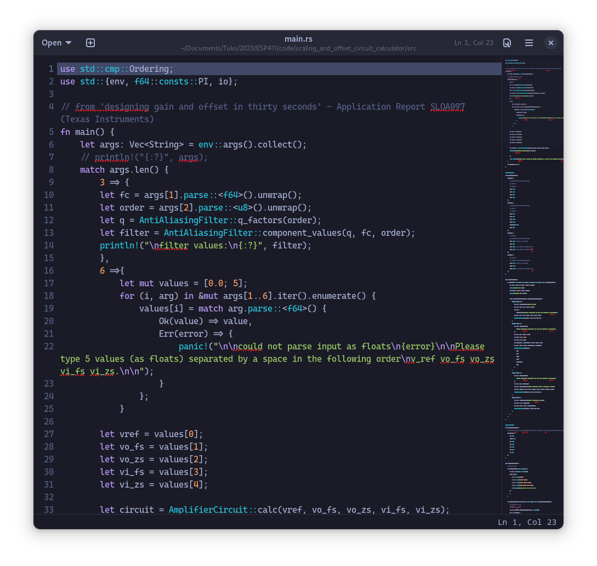

# tokyo-night-gtksourceview

[tokyo night colorscheme](https://github.com/enkia/tokyo-night-vscode-theme) for gtksourceview5 applications  (gnome text editor, gedit, builder)

this scheme uses the [one made by the dracula team](https://draculatheme.com/gedit) as a base, I just modified the colors 

I've only tested with gnome text editor and there is no light mode option



## installation

```
curl https://raw.githubusercontent.com/kevin-nel/tokyo-night-gtksourceview/main/tokyo-night.xml > tokyo-night.xml
mv tokyo-night.xml ~/.local/share/gtksourceview-5/styles
```
